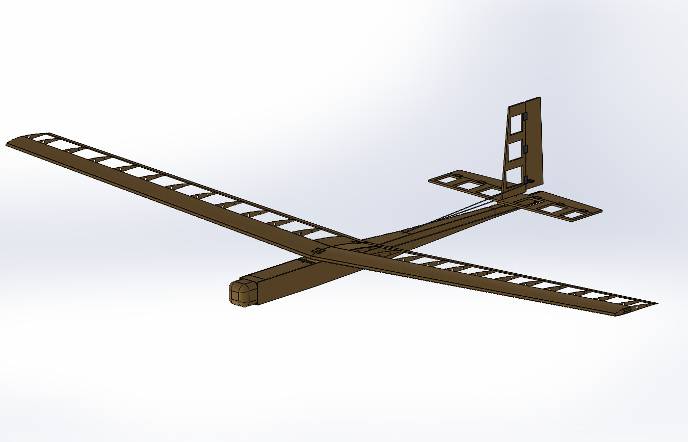
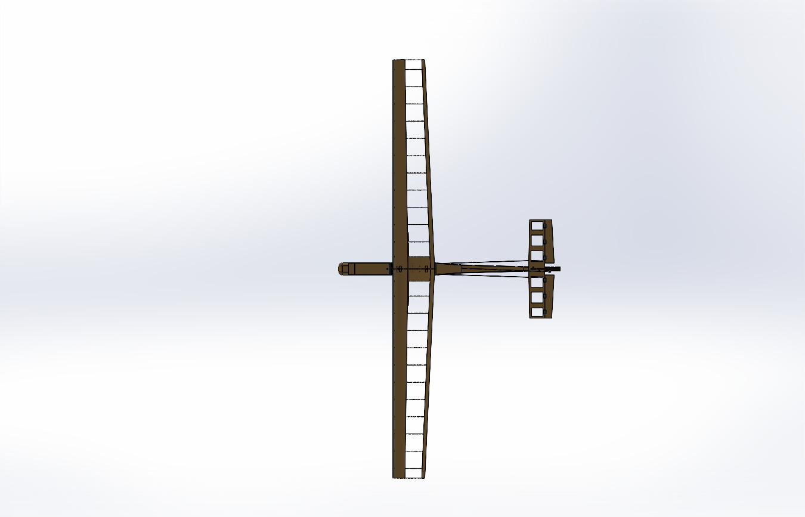
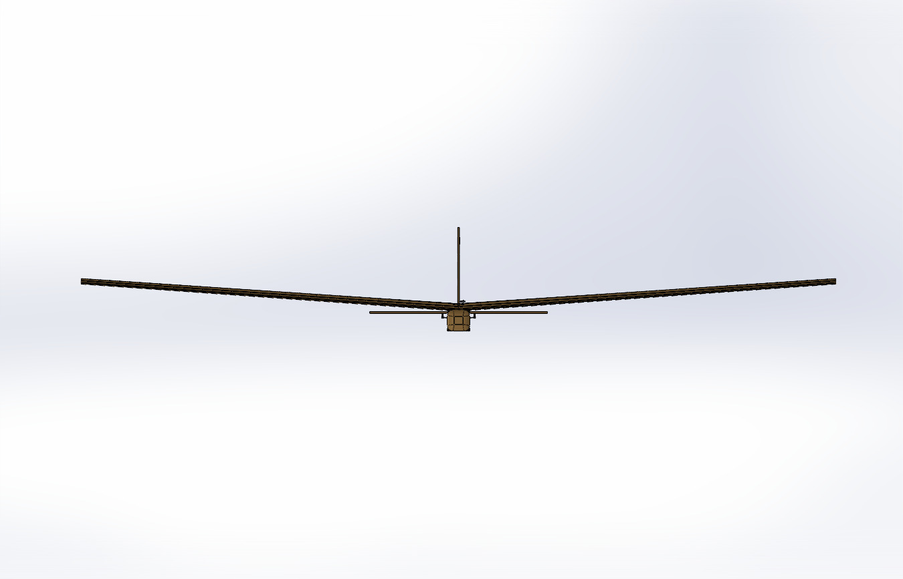
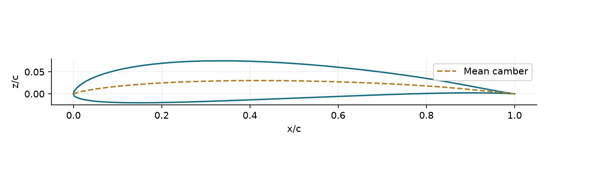
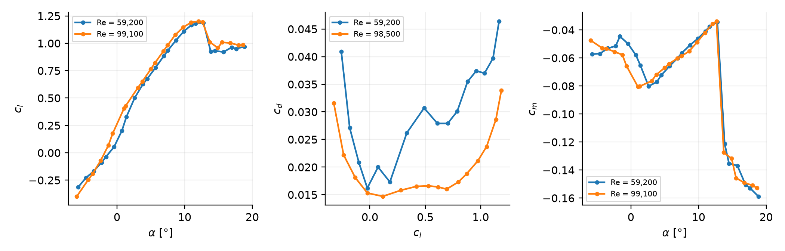
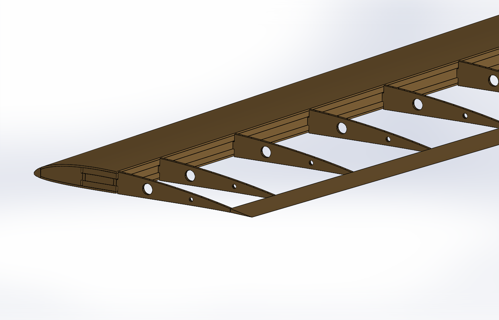
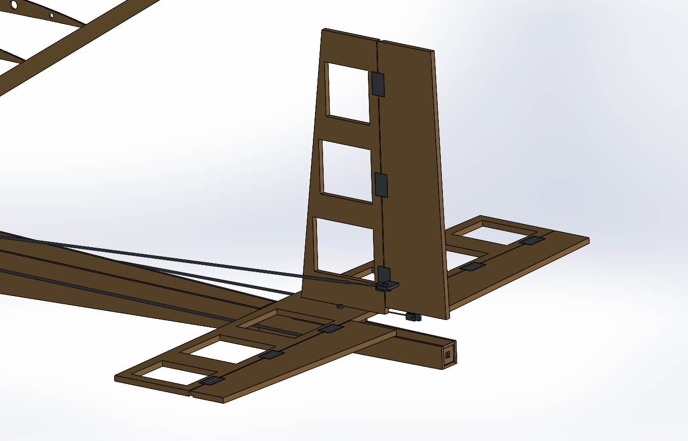

# Balsa Glider Design

**A 1.7 m wingspan glider combining built-up structural design, CAD modeling, airfoil selection, and aerodynamic analysis.**

This project develops a lightweight balsa glider within defined geometry and mass constraints. It includes a structural CAD assembly, estimated mass properties, aerodynamic performance predictions, and longitudinal trim and stability calculations.

> **Status:** R03 design and analytical assessment. Prototype construction and flight validation are pending. The revised detailed construction guide is under development.



## Contents

- [Project Overview](#project-overview)
- [Design Specifications](#design-specifications)
- [Model Views](#model-views)
- [Airfoil Selection](#airfoil-selection)
- [Structural Components](#structural-components)
- [Aerodynamic Analysis](#aerodynamic-analysis)
- [Predicted Performance](#predicted-performance)
- [Trim and Stability](#trim-and-stability)
- [Planned Construction Workflow](#planned-construction-workflow)
- [Geometry Review](#geometry-review)
- [Files and Documentation](#files-and-documentation)
- [Limitations and Next Steps](#limitations-and-next-steps)
- [References](#references)

## Project Overview

The intended application is indoor gliding in an unobstructed hall, with attention to distance, airspeed, structural mass, and practical assembly.

The design process includes:

- Selecting wing and tail dimensions within the project constraints.
- Selecting the SD7037 wing airfoil.
- Generating structural geometry programmatically using CadQuery.
- Assembling and inspecting the model in SolidWorks.
- Estimating mass and center-of-gravity position.
- Solving aerodynamic lift, drag, trim, and local static stability.
- Planning the construction sequence for a built-up balsa structure.

Performance values presented here are analytical predictions. They have not been verified through flight testing.

## Design Specifications

| Parameter | R03 value |
|---|---:|
| Wingspan | 1,700 mm |
| Fuselage length | 900 mm |
| Wing airfoil | SD7037 |
| Wing area | 0.255 m² |
| Root chord | 170 mm |
| Tip chord | 130 mm |
| Taper ratio, λ | 0.7647 |
| Aspect ratio, AR | 11.33 |
| Mean aerodynamic chord | 150.89 mm |
| Wing incidence | +2° |
| Dihedral | 4° per side |
| Leading-edge sweep | 0° |
| Geometric washout | 0° |
| Horizontal-tail span | 400 mm |
| Horizontal-tail area | 0.039 m² |
| Horizontal-tail incidence | 0° |
| Vertical-tail area | 0.01995 m² |
| Estimated flight mass | 434.6 g |
| Estimated wing loading | 17.04 g/dm² |
| Target CG | 45.24 mm aft of the wing root leading edge |

Mass and wing loading must be updated after construction using the actual equipment and finished structure.

## Model Views

### Top View

The top view shows the wing planform, tail arrangement, and overall component placement.



### Wing Dihedral View

This view illustrates the dihedral arrangement and overall alignment.



The CAD images are visual references. Dimensions should be taken from the engineering data and CAD model rather than measured from screenshots.

## Airfoil Selection

### SD7037 Geometry



SD7037 was selected as a practical candidate for the low-Reynolds-number conditions of this glider.

The main considerations were:

1. **Experimental data coverage**  
   Available measured section data bracket the reference operating Reynolds numbers, supporting interpolation of lift, drag, and pitching moment.

2. **Space for the wing structure**  
   Approximately 9.22% maximum thickness provides room for spar caps, shear webs, and the forward wing skin.

3. **Camber suitable for the required lift**  
   Approximately 3.02% maximum camber supports positive lift at modest section angles of attack.

| Section property | Calculated value |
|---|---:|
| Maximum thickness | 9.218% of chord |
| Maximum-thickness location | x/c ≈ 0.2858 |
| Maximum camber | 3.022% of chord |
| Maximum-camber location | x/c ≈ 0.4153 |
| Maximum root thickness | 15.67 mm |
| Maximum tip thickness | 11.98 mm |

These values were calculated from the coordinate interpolation used by the CAD model.

### Experimental Section Polars



The plots show, from left to right:

- Section lift coefficient $c_l$ versus angle of attack $\alpha$.
- Section drag coefficient $c_d$ versus section lift coefficient $c_l$.
- Section pitching-moment coefficient $c_m$ versus angle of attack $\alpha$.

The displayed lift and moment datasets use Reynolds numbers of 59,200 and 99,100. The drag datasets use 59,200 and 98,500.

These are **two-dimensional experimental airfoil data**, not whole-aircraft performance curves.

### Selection Trade-offs

The negative section pitching moment requires a balancing tail contribution. At the reference operating point, the tail produces a small downward force, increasing the lift required from the wing.

Low-Reynolds-number performance also depends on surface finish, leading-edge accuracy, and covering deformation.

SD7037 is the selected candidate for this configuration. A systematic comparison establishing it as the best possible airfoil has not been performed.

## Structural Components

### Wing Structure



The built-up wing includes:

- Balsa ribs with plywood reinforcement near the root.
- Upper and lower spar caps.
- Front and rear shear webs.
- A skinned forward D-box.
- Leading-edge and trailing-edge members.
- Reinforced root sheeting and central joiners.
- Local mounting blocks and bolt seats.

The ribs define the section shape, while the spar and forward box provide the intended structural load paths. Physical strength depends on the actual materials, workmanship, and joints.

### Fuselage

The fuselage contains:

- Balsa side, top, and bottom panels.
- Internal formers.
- Wing and tail mounting saddles.
- Battery and servo trays.
- A removable battery hatch.
- Control-link routing.
- An enclosed ballast location.

The final equipment mounts and attachment details must match the actual purchased components.

### Tail Assembly



The tail assembly includes:

- A horizontal stabilizer with symmetric lightening openings.
- Closed 8 mm tip strips on the horizontal stabilizer.
- Separate left and right elevator halves.
- A vertical fin and rudder.
- Hinges, control horns, and linkage provisions.

The modeled control-surface checking ranges are ±15° for the elevators and ±25° for the rudder. These are geometric inspection ranges, not flight-tested control settings.

## Aerodynamic Analysis

The analytical model combines:

1. Experimental SD7037 section data.
2. Interpolation in angle of attack and Reynolds number.
3. A nonlinear lifting-line solution for the finite wing.
4. An analytical horizontal-tail model.
5. Simultaneous lift and pitching-moment equilibrium.
6. Estimated fuselage, fin, and additional drag contributions.

The baseline wing solution uses 14 odd Fourier terms. A 20-term solution provides a numerical convergence comparison.

### Wing Geometry

For the trapezoidal planform:

$$
\lambda = \frac{c_t}{c_r}
= \frac{130}{170}
= 0.7647
$$

$$
S = \frac{b(c_r+c_t)}{2}
= 0.255\ \mathrm{m^2}
$$

$$
AR = \frac{b^2}{S}
= 11.33
$$

$$
\bar{c}
= \frac{2c_r}{3}
\frac{1+\lambda+\lambda^2}{1+\lambda}
= 0.15089\ \mathrm{m}
$$

The dimensions were selected within the project constraints and subsequently assessed. They are not uniquely determined by these equations.

### Reference Operating Conditions

| Quantity | Assumed value |
|---|---:|
| Air density, ρ | 1.225 kg/m³ |
| Dynamic viscosity, μ | 1.789 × 10⁻⁵ Pa·s |
| Gravitational acceleration, g | 9.80665 m/s² |
| Reference airspeed, V | 7.50 m/s |

$$
Re = \frac{\rho Vc}{\mu}
$$

At the reference speed:

- Root Reynolds number: approximately **87,304**.
- Tip Reynolds number: approximately **66,762**.

$$
q = \frac{1}{2}\rho V^2
= 34.453\ \mathrm{Pa}
$$

Using the small-glide-angle approximation $L \approx W$:

$$
C_L \approx \frac{mg}{qS}
= 0.48513
$$

Lowercase coefficients describe two-dimensional sections. Uppercase coefficients describe the wing or aircraft, with the applicable reference quantities defined in the report.

## Predicted Performance

| Quantity | Reference condition | Best sampled glide point |
|---|---:|---:|
| Airspeed | 7.50 m/s | 6.75 m/s |
| Aircraft lift coefficient, C_L | 0.48513 | 0.59892 |
| Aircraft drag coefficient, C_D | 0.03932 | 0.04462 |
| Lift-to-drag ratio, L/D | 12.34 | 13.42 |
| Sink rate | 0.606 m/s | 0.502 m/s |
| Elevator trim | −2.41° | −3.91° |

Negative elevator deflection means trailing-edge up.

The speed sweep covers 6.50–10.50 m/s in increments of 0.25 m/s. The 6.50 m/s point is excluded because the tip Reynolds number falls below the available measured-data range.

**The 6.75 m/s result is the best retained point in this discrete sweep. It is not a verified stall speed or a proven continuous optimum.**

Aircraft performance plots and detailed numerical substitutions are provided in the [English aerodynamic report](reports/Glider_R03_Airfoil_Aerodynamics_EN.pdf).

### Drag Breakdown at 7.50 m/s

| Contribution | C_D | Basis |
|---|---:|---|
| Wing profile drag | 0.0231934 | Measured section data |
| Wing induced drag | 0.0073191 | Lifting-line solution |
| Horizontal tail | 0.0018058 | Analytical model and assumptions |
| Vertical tail | 0.0009388 | Assumed profile drag |
| Fuselage | 0.0030588 | Estimated wetted-area model |
| Additional allowance | 0.0030000 | Seams, roughness, and hardware |
| **Total** | **0.0393160** | **Combined estimate** |

The tail, body, and additional drag contributions have not been independently measured on the complete aircraft.

## Trim and Stability

The model solves lift and pitching-moment equilibrium about the center of gravity.

At 7.50 m/s:

| Quantity | Predicted value |
|---|---:|
| Body angle of attack | 1.366° |
| Wing lift coefficient | 0.49992 |
| Wing pitching-moment coefficient | −0.07718 |
| Tail lift | −0.1299 N |
| Elevator trim | −2.408° |
| Lift-curve slope, C_Lα | 5.550 rad⁻¹ |
| Pitching-moment slope, C_mα | −1.088 rad⁻¹ |
| Local static margin | 19.60% MAC |
| Approximate neutral-point position | X = 294.81 mm |

$$
SM = -\frac{C_{m_\alpha}}{C_{L_\alpha}}
$$

The negative pitching-moment slope indicates local longitudinal static stability under the model assumptions.

It does not establish dynamic stability, lateral/directional stability, flutter clearance, or post-stall behavior.

## Planned Construction Workflow

This is the intended assembly sequence, not a record of completed construction or a substitute for detailed manufacturing drawings.

| Stage | Planned work | Main check |
|---|---|---|
| 1. Material preparation | Identify stock, grain direction, and part labels | Thickness and material mass |
| 2. Wing framework | Fit ribs, spar caps, and shear webs | Rib order, alignment, and symmetry |
| 3. Wing skinning | Fit the D-box skin and edge members | Airfoil contour and unintended twist |
| 4. Center joint | Fit joiners on a dihedral jig | 4° dihedral per side and joint contact |
| 5. Fuselage assembly | Install formers, panels, trays, and saddles | Straightness and internal access |
| 6. Tail assembly | Fit stabilizers, control surfaces, and hinges | Alignment and free movement |
| 7. Equipment installation | Install actual servos, battery, and linkages | Secure mounts and unobstructed controls |
| 8. Covering | Apply covering progressively and symmetrically | Surface quality and retained alignment |
| 9. Final balancing | Weigh the complete aircraft and adjust ballast | Actual mass and target CG |
| 10. Validation | Conduct controlled prototype checks | Measured trim and flight performance |

The revised step-by-step construction guide is pending completion and is not included in the current repository documentation.

## Geometry Review

Recorded R03 revisions include:

- Closing the horizontal-tail tips and correcting lightening-opening symmetry.
- Revising wing bolt-head seats and saddle geometry.
- Staggering tail mounting screws to clear the vertical-fin base.
- Improving battery-tray and hatch-support contacts.
- Revising control-link routing and local mating pockets.

The recorded review covers 136 modeled part groups, pairwise interference screening, and targeted mounting and control-surface checks.

Small wood-to-wood fitting allowances and simplified hardware engagements remain in the model. Geometry review does not demonstrate actual material strength or flightworthiness.

## Files and Documentation

### Engineering Files

- [R03 STEP assembly](cad/Glider_R03_Structure.step)
- [Airfoil Selection and Aerodynamic Analysis — English PDF](reports/Glider_R03_Airfoil_Aerodynamics_EN.pdf)

The STEP file contains exchange geometry. It does not preserve the original feature history or SolidWorks assembly constraints.

### Repository Structure

```text
balsa-glider-design/
├── README.md
├── .gitignore
├── requirements.txt
├── THIRD_PARTY_NOTICES.md
├── cad/
│   └── Glider_R03_Structure.step
├── images/
│   ├── airfoil-polars.png
│   ├── airfoil-sd7037.jpg
│   ├── Glider_leftview.JPG
│   ├── Glider_topview.JPG
│   ├── glider-overview.JPG
│   ├── tail-assembly.PNG
│   └── wing-structure.PNG
├── reports/
│   └── Glider_R03_Airfoil_Aerodynamics_EN.pdf
├── source/
└── results/
```

The `source/` and `results/` folders are reserved for calculation scripts and supporting outputs as they are added. Reproduction instructions will accompany those files.

## Limitations and Next Steps

The analysis includes assumptions for:

- Tail dynamic-pressure ratio and elevator effectiveness.
- Downwash and fuselage pitching-moment contribution.
- Fuselage drag and surface roughness.
- Material densities and equipment mass.
- The relationship between ideal geometry and the finished structure.

The English report documents the assumed section-moment reference, the baseline wing-tip endpoint approximation, and the difference between numerical convergence and physical validation.

Next steps:

- Complete the revised construction documentation.
- Fit the design to the selected physical equipment.
- Measure the finished mass, CG, and installation angles.
- Validate control motion and structural workmanship.
- Compare measured airspeed and sink rate with the analytical predictions.

No experimentally validated whole-aircraft maximum lift coefficient, stall speed, or competition-course range is claimed.

## References

- [UIUC SD7037 coordinate file](https://m-selig.ae.illinois.edu/ads/coord/sd7037.dat)
- [UIUC Low-Speed Airfoil Tests](https://m-selig.ae.illinois.edu/uiuc_lsat.html)
- [UIUC experimental data index](https://m-selig.ae.illinois.edu/pd.html)

**The experimental airfoil performance data were produced under the UIUC Low-Speed Airfoil Test program.**

The analysis uses the clean SD7037 (D) specimen datasets:
`SD7037D.LFT` and `SD7037D.DRG`.

Third-party data retain their applicable notices and terms. No project-wide license is intended to override the rights associated with those datasets.